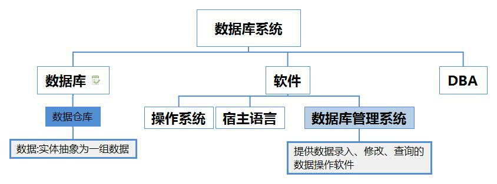

# 四个基本概念
任何一本有关数据库系统的书都会从四个基本概念出发，从数据出发一步步了解数据库各个部分的功能。
## 1. 数据
**数据**[Data]: 数据是数据库中存储的基本对象。需要保证数据的正确性 有效性 相容性

数据可以是任意具有语义的某一类型的数据:包括 `数值型数据` `文本型数据` `音频` `图像` `学生信息` `货物销售信息`等....

> 一定要保证所有数据必须拥有确定的语义,对于一组数据,其语义应当确定唯一.


```json
// 在不约束语义的情况下，同一组数据用有不同的含义。
//比如我们有一组数据

{"北京","牛肉","500"}

//那么这组数据的意义可能是

北京牛肉的价格为500元/公斤

也可以是

北京的牛肉供应为500吨/月

相应的我们规定语义[即规定数据类型]为

{"地区","食品","日消耗量"}
对应数据:
{"北京","牛肉","500"}
那么真实的意义应为:北京的牛肉日消耗量为500公斤/天

```

##  2.数据库
**数据库**:按照数据结构来组织、长期存储和管理数据的仓库.

数据库3个基本特点:`长期存储` `有组织` `可共享`


## 3. 数据库管理系统[DBMS]

**DBMS**[DataBase Management Sys] :数据库管理系统是一种操控和管理数据库的大型系统软件,用于建立、使用和维护数据库，它对数据库进行统一的管理和控制，以保证数据库的**安全性**和**完整性**. DBMS是一个软件系统，由**互相关联的数据的集合**+**访问数据所需的程序**构成。
> 这些关联数据构成的集合为**数据库**[DataBase]

数据库管理系统应当提供四方面数据控制功能:
* **数据安全性控制**:不因非法使用数据而导致数据泄露和破坏
* **数据完整性控制**:设置完整性规则保证数据的正确性 有效性 相容性
* **并发控制**:多用户使用或者更改数据库的时候,防止因相互干扰而给用户提供不正确的数据,病使数据库收到破坏
* **数据恢复**:当数据库收到破坏或者数据不可靠的时候,系统有能力将数据库从错误状态恢复到最近某一时刻的正确状态.

## 4. 数据库系统 (DATABase Sys-DBS)

数据库系统是是一些相互关联的数据+一组可以使得用户访问和修改数据的程序集合=>最终目的是提供给用户使用

> 数据库系统=数据库+软件+DBA+用户




