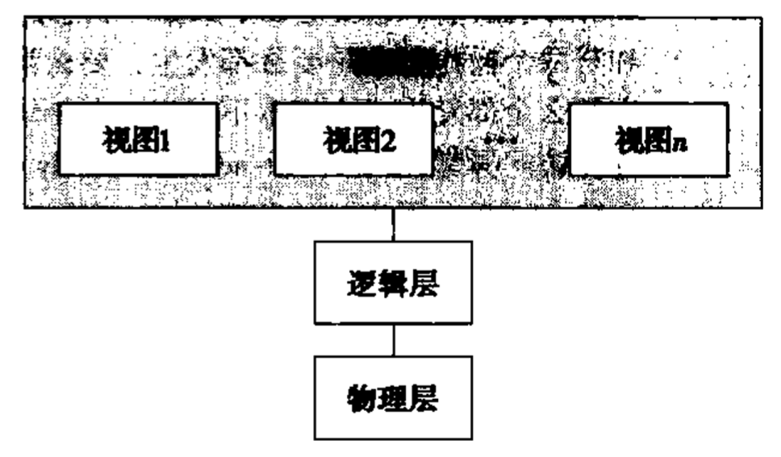
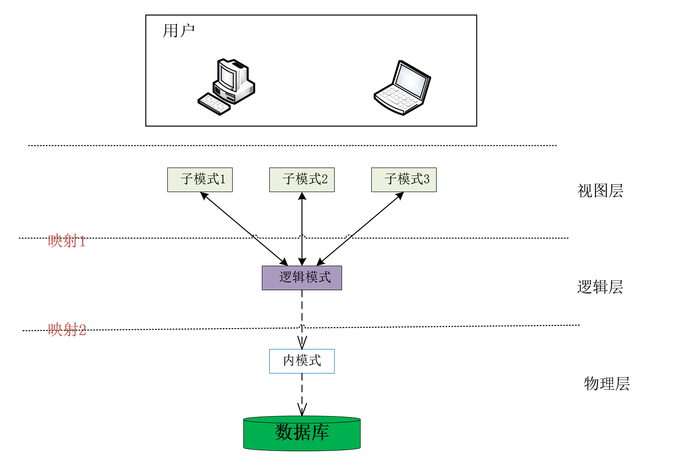

#  数据视图
数据库系统的一个重要目的就是向用户提供`数据的抽象视图`, 即系统隐藏关于数据存储和维护的某些细节.  
在用户使用 管理员管理过程中, 将如此复杂的系统直接暴露给用户是不安全的.如同墨菲定律: 即使所有人都知道某个操作会带给系统不可逆的毁灭性打击, 依旧会有人无意的选择此操作. 

> 在视图的约束下, 数据库中的其他数据则既看不见也取不到, 数据库授权命令可以使每个用户对数据库的检索限制到特定的数据库对象上, 但不能授权到数据库特定行和特定的列上, 通过视图, 用户可以被限制在数据的不同子集上. [牛客网]
 
在用户的观点看来, 数据视图是操作数据库后所得结果数据的表现形式. 例如: 关系型数据库进行数据操作后返回的数据以表格的形式展现 => 数据视图为就是查询所得的数据表
> 所以在三级模式中, 我们将用户所见的外模式中的数据称为视图View

为了抽象一个数据库系统.我们先将数据库中的数据进行抽象分层, 向高层屏蔽底层的实现方式(数据结构)`类似于计算机网络的csi参考模型`; 之后对数据库中的数据设计方法进行一种结构性的描述总结为**模式**, 将数据库的总体设计归为`模式-实例`; 

> 视图和模式并不是同一种东西. 视图向用户提供数据-数据结构信息, 模式-实例向用户提供数据库系统结构设计的描述。数据库模式是建立在视图基础上的

## 1. 数据抽象的层次--数据抽象
高可用的系统必须能高效的检索数据, 这种高效性的需求促使设计者在数据库中使用复杂的数据结构来表示数据. 因不能保证用户受过计算机训练, 系统的开发员应当对数据库系统在层次上抽象, 方便**对用户屏蔽系统的复杂性**. 

* **物理层**[physical level] : 最底层的抽象, 描述数据究竟是如何存储的. 物理层详尽的描述了复杂的底曾数据结构. `该层应当只对数据库开发人员开放`
* **逻辑层**[logical level] : 稍高于物理层,描述数据库中存储什么数据以及这些数据之间存在什么逻辑关系, 这样逻辑层就可以用少量的数据结构描述数据间的逻辑关系而不需要考虑存储方式. 逻辑层应当保证`数据物理独立性`,逻辑层用户无需知道物理层结构的复杂性也可以完全使用逻辑层接口.
* **视图层** : 最高层次的抽象,只描述数据库的某个部分. 虽然在逻辑层使用比较简单的结构, 但是一个数据库中存储的信息多样数据量巨大, 依旧有一定程度的复杂度. 那么将数据库的部分抽象为视图, 屏蔽掉该用户不需要的数据并暴露出去,使得用户与数据库系统的交流更简单. **数据库系统可以为同一个数据库提供多个视图**
  

  
> 在视图层中, **计算机用户**看见得是为其屏蔽了数据类型细节的一组应用程序
> 
> 同理, 在视图层上定义了数据库的多个视图,**数据库用户**看到的只有一些视图 
> 
> 视图层在屏蔽数据库逻辑层细节之外, 还提供部分安全性功能, 比如向权限不足的用户屏蔽某些敏感数据防止篡改

## 2. 模式 - Schema

随着时间的推移, 信息会被插入或者删除, 数据库内容也就发生了变化. 于是我们引入实例和模式的概念. 

* 实例[instance]: 特定时刻存储在数据库中的数据的集合称为数据库的一个实例.
* 模式[schema]: 数据库的总体设计称作模式,数据库模式一旦设计完成,那么将很少改变,我们也应尽量减少数据库模式的更改. 
  
> 模式反映的是数据库的结构及其联系, 所以是相对稳定的.
> 
> 实例反映的是数据库某一时刻的状态, 所以是相对变动的.

### 2.1 三层模式
数据库系统提供的数据被抽象为三个层次(物理层-逻辑层-视图层), 相对应的数据库系统可以分为相应的三层模式. 

1. **内模式**[物理模式]: 在数据抽象的物理层描述数据库的设计. 内模式需要定义所以的内部记录类型、索引和文件的组织方式，以及数据控制方面的细节. 
2. **逻辑模式**[概念模式]: 在数据抽象逻辑层描述数据库的设计. 概念模式不仅要描述概念记录类型, 还要描述记录间的联系 操作 数据的完整性和安全性等要求. 逻辑模式应当保持物理数据独立性.
3. **外模式**  [子模式]: 描述数据库的不同视图, 是用户与数据库系统的接口. 数据库在视图层中可以有多重模式,所以外模式也可以有多种. 

其中最重要的是逻辑模式, 程序员往往依赖逻辑模式来构造数据库应用程序. 物理模式隐藏在逻辑模式之下, 并且通常可在应用程序丝毫不受影响的情况下被轻易地更改. 所以引入一个**物理数据独立性**的概念: 若应用程序不依赖于物理模式, 当物理模式改变的时候应用程序也无需重写, 称为物理数据独立. 

> 逻辑模式应当描述记录类型 记录之间的联系 操作 数据完整性约束等性质,不应牵扯存储结构 访问技术 等物理细节,尽力保持物理数据独立性.

### 2.2 两级映射
在三层模式的分界线上,我们对应抽象出两级映像, 两级映像的功能一般都由数据库管理系统DBMS来实现, 目的是保证数据独立性.

* 映射1: **外模式/逻辑模式映射** : 实现外模式-逻辑模式之间的相互转换

* 映射2: **逻辑模式/内模式映射** : 实现逻辑模式-内模式之间的相互转换

引入一个概念

**数据的独立性**:数据与程序独立, 将数据的定义从程序中分离出去交由DBMS实现, 以降低程序的复杂度. 

`数据独立性=数据物理独立性+数据逻辑独立性`

1.数据的物理独立性: 当数据库的内模式发生改变时, 数据的的逻辑结构不变.  
2.数据的逻辑独立性: 当数据库的逻辑模式发生改变时, 用户在视图层所见的数据视图不变, 程序可以不修改. 

> 物理独立性保证: 当数据的物理结构改变时, 只需要修改逻辑模式/内模式映射, 逻辑模式及外部模式不变, 应用程序无需改变. 
>
>逻辑独立性保证: 数据的逻辑结构发生变化后，修改外模式/逻辑模式之间的映像, 物理模式不变, 用户在视图层所得数据依旧, 用户程序也可以不修改. 

# tips
1. 数据库系统的`三级模式两级映射`的结构被大量广泛应用, 但是并不是所有的数据库都一定满足这种结构. 但是在关系型数据库中, 这终结构是每一个DBS都满足的.
2. 在关系型数据库中, 三级模式有另外的名字. 
   *  逻辑模式即为基本表(关系模型中的关系模式称为基本表,一个关系对应一个基本表, 基本表直接建立在存储文件上)
   *   外模式对应数据视图(基本表选择一部分可以暴露给用户的数据进行导出 即为视图. 比如在SQL中视图就是一系列公式, 视图并未存在存储文件中)  
   
   * 内模式即为存储文件的存储方式和结构,(一般DBMS很少提供物理模式的操作权限, 但是我们可以简单的定义如索引 存储引擎等少量属性)
3.  两级映像仅仅是也只能是在系统理论设计层面上保证数据的独立性, 如同计算机网络中的CSI参考模型一样, 只能提供一种建议. 实际情况中有可能物理模式的变化会大改应用程序. 