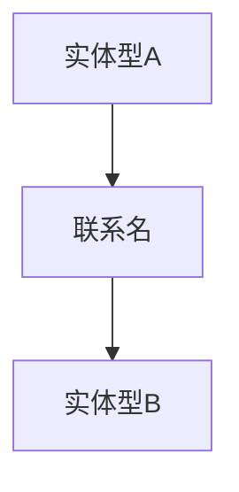
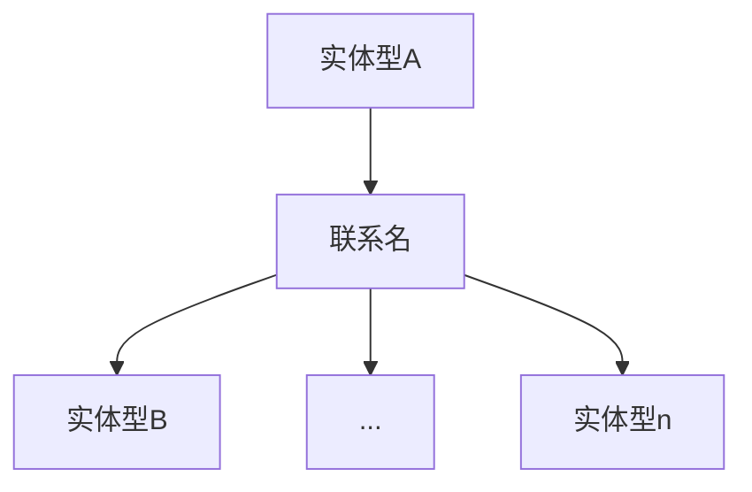
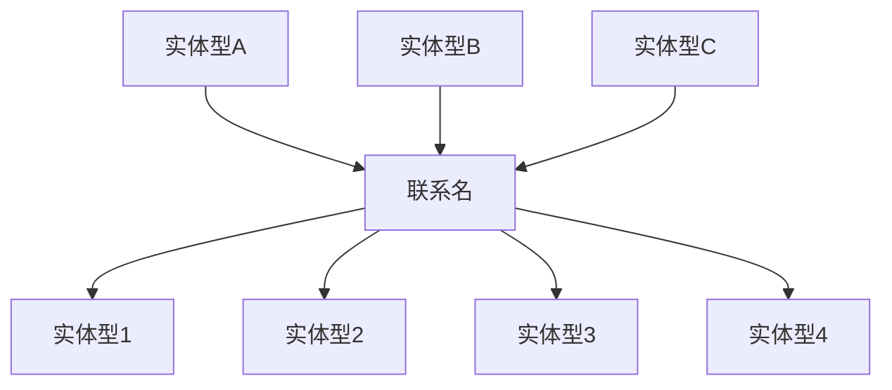

# 关系型数据库
数据模型是描述数据 数据联系 数据语义 一致性约束的概念工具的集合. 这样我们只需要研究数据模型, 而不需要关心更底层的实现.
> 数据模型的三约束: `数据结构` `数据操作` `数据约束`

关系型数据库的结构非常简单, 被广泛应用的原因就是因为其数据结构简单:
* 数据结构: 只有一种数据结构 - 表
* 数据操作: 由DDL DML两者结合实现
* 数据约束: 完整性约束 事务管理 ...
  
## 信息
在关系代数之前, 我们应当了解`如何将一条信息[或某个具体事物]抽象的表达出来`
* **实体**[Entry]: 客观存在的可相互区别的事物. (区别数据库系统中的实例)
* **属性**[Attribute]: 特定描述一类实体具有的某一共同特性. 
* **实体型**[Entry Type]: 具有相同属性的实体必然具有共同的特征和性质。用实体名及描述它的各属性名，可以刻画出全部同质实体的共同特征和性质，称为实体型. `一个集合{实体名+属性名} => 构成实体型` 
* **实体集**: 同一类实体构成的集合. 

``` json
// 我们有个一个对象[实体],描述的是一名老师的信息
// 名字叫kim, 授课学科为生物, 薪资为10000元
{
    id:1,
    name:"Kim",
    dept_name:"Biology",
    salary:10000
}


// 这是三名教师共同构成的实体集
{
    {
    id:1,
    name:"Kim",
    dept_name:"Biology",
    salary:10000
    },{
    id:2,
    name:"Tom",
    dept_name:"Math",
    salary:20000
    },{
    id:3,
    name:"Jack",
    dept_name:"Physics",
    salary:15000
    }
}

```
按顺序分析:
1. 对于这个id=1的实体, 每一个键值对的key就是一个属性(属性"name"的属性值为"kim"). 

2. 这一类实体[一类教师]所具有的属性共同可构成属性集, 属性集就是`{id,name,dept_name,salary}`

3. 当然, 教师的数量一般都不是一个, 我们有许多教师的时候, 所有教师构成的集合为实体集. 
4. 于是我们可以用实体型来概述一类实体的共有特性: `教师(id, 姓名 , 授课学科, 薪资)`. 使用实体型可以确定的描述一名教师: `教师(1, kim,Biology , 10000`


## 联系-Relationship
实体之间存在关系，这些关系成为**联系**。
* 实体内部联系: 某一实体内部属性之间存在联系. 某学生的考试排名与其几门课程的成绩值有联系
* 实体之间联系: 不同实体之间存在联系.

### 一对一型联系


### 一对多型联系



### 多对多型 m-n型




## 表-Table
在上面的关于教师的实体型中, 我们使用`教师(id, 姓名 , 授课学科, 薪资)`来描述教师这一类事物[人], 我们也可以使用表格来描述这种联系.


 |  id   | name  | dept_name | salary |
 | :---: | :---: | :-------: | :----: |
 |   1   |  Kim  |  Biology  | 10000  |
 |   2   | Jack  |   Math    | 20000  |
 |   3   |  Kim  |  Physics  | 15000  |

 
我们就将这种以表格形式表达的数据模型, 称**关系模型**.

 简单的说在数据库系统中, 一个关系[relationship]就是一张表, **是将一系列满足条件的数据项构成的集合以表格的形式表达出来**, 我们可以简单的认为**关系操作实则就是集合的操作**
> [success] IBM的关系模型
> 
> 关系模型是基于表格的数据模型, 最早于1970年由IBM的研究员E.F.Codd博士拓展了关系代数并严格定义了关系模型. 但是早在关系模型出现之前, 数学上已经有对表格进行了严格集合理论和逻辑学理论.E.F.C博士也因此获图灵奖