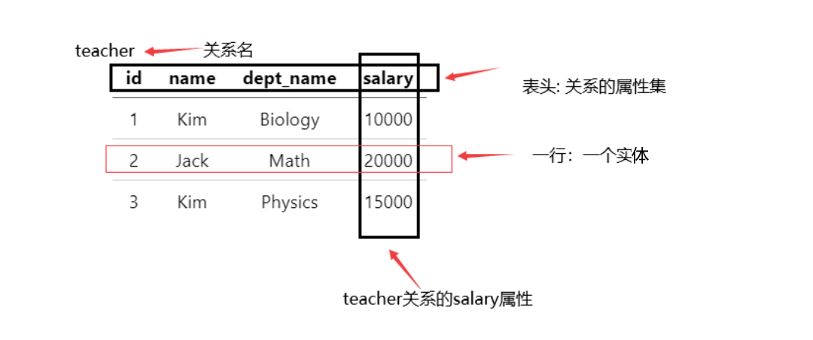

# 关系模型
前面说, 拥有**相同实体型**的数据, 可以根据数据之间的联系构成一张表, 我们就称这张表为**关系**. 

 |  id   | name  | dept_name | salary |
 | :---: | :---: | :-------: | :----: |
 |   1   |  Kim  |  Biology  | 10000  |
 |   2   | Jack  |   Math    | 20000  |
 |   3   |  Kim  |  Physics  | 15000  |

* 关系型数据库由表的集合构成, 每个**表都有唯一的名字**
* 表中一行代表了一组值之间的联系, 例如上面的的第二行,`Jack` `Math` `salary`数据是共同属于一名id=2的数学教师的信息,并且二者在语义上是紧密相连的, 教授科目影响着教师的薪资 
  
## 表 

在数据模式中, 我们已经有了`属性-记录-联系`的概念, 这些都可以在一张或数张表中完整的描述. [二维表]
1. 属性: 在表中, 属性就是Table的列, 表头对应的列就是属性名[数据项/字段]
2. 记录: 表主体中的每一行都是一条记录, 表内数据就是由这些就记录构成的
3. 联系: 列与列之间的联系, 甚至可以是不同表之间列的关系.
   

### 关系:一种特殊的表
我们可以简单的认为, 关系是一种满足特殊条件的二维表格:
* 关系中每一个属性值是不可分解的[原子性]
* 关系中不允许出现重复元组[数据模型本身就是一个集合,集合有天然去重性质]
* 关系没有行序[关系是一个集合, 因此不考虑元组间的顺序]
* 关系的属性也可以是无序的[一般情况为了保证语义我们会给列排序,实则在元组由属性名索引的时候,关系模型无须保持列有序]
  
### 严格定义一张表

我们可以用这样的实体集来描述一个关系: `教师(id, 姓名 , 授课学科, 薪资)`

也可以在表格中表达:
* 表头: 应当指定关系名[模式/schema]. (表名不可忽略)
* 行: 一行对应一个实体, 将行独立出来可以构成一个n元组, n为表的属性个数[表的字段数/n元组的分量个数]
* 列: 列名对应元组的分量. 列的取值范围即为域(所以在定义一个数据表的时候需要指定int char等数据类型, 视为该列的域)
* 码/键[key]:关系表中用于唯一标识一行的`某一列或几列构成的属性集`, 此处由id列唯一标识一行(由id这个属性构成的属性集可以唯一确定teacher表的一行)
* 属性: 又称为字段/列名/数据项
* 基数[cardnality]: 集合内元素的个数.
  * 域的基数就是该列所有可能取到的值的个数
  * 表的基数就是行数
  

  

## 码
码是数据系统中的基本概念。所谓**码**就是能**唯一标识实体的属性**, 他是整个实体集的性质, 而不是单个实体的性质. 我们可以简单的认为, 一个关系(实体集)所有的属性共同构成**码**

**码**由三部分组成, 相互呈包含关系`超码` `候选码` `主码`

### 超码
* 超码: 超码是一个或多个属性构成的集合
* 作用: 在一个关系中唯一的标识一个元组
  
特点
1. 超码可能包含无关属性
2. 一个关系一定有超码(关系内所有属性构成的集合一定是超码，能唯一确定一个元组)
3. 超码的任意超集也是超码

关于超码的任意超集也是超码

已知我们有一个关系
$$Relation:R$$
R关系中的属性构成两个属性集合 $$K$$ 和$$S$$并且
$$K \in S $$ 

如果属性集$$K$$是关系$$Relation:R$$的超码, 那么属性集$$S$$也一定是该关系的超码

### 候选码/候选键
 
* **候选码**[candidate key又称候选键]: 若关系中的一个属性或属性组的值能够唯一地标识一个元组，且他的真子集不能唯一的标识一个元组，则称这个属性或属性组做候选码。
* 作用: 在一个关系中唯一的标识一个元组

特点
* 候选码是极小的超码集(超码的一个子集), 也就是它的任意真子集都不是超码,而他本身是超码.
* 候选码中没有无关属性
  * 候选码共同作用, 可以唯一的标识关系中的一个元组
  * 从该属性组中去除任意一个属性, 这个元组就不再能被唯一标识
* 建表时应当优先考虑候选码因素, 尽量保持"改变表结构是候选码的数量和项目不变"

> 
> 例: `课程(S#,Sname,Cname,Grade)`
> 
> 该关系的候选码由`{S#}`构成, 某实体由S#唯一标识, 如果去除S#, 那么对于同班同名的同学将无法区分

### 主码/主键
**主码**: 被数据库设计者选中的, 用来在同一实体集中区分不同实体的候选码; 此外, 应该选择哪些从不或极少变化的属性. 
**补码**: 选定主码后剩余的候选码为补码

特点:
* 主码是候选码之一
* 任意候选码都可以被DBA选择称为主码,但是应当按实际情况选择
* 主码可以不指定,不指定时该关系无主码;一旦选择主码, 则主码是唯一的,不允许选择多个主码

### 外码/外键
**外码**是关系之间码的联系.
若R1关系的属性A同时是另一个关系R2的主码, 那么A属性就是外码

外码联系满足参照关系

**参照完整性约束**: 在参照关系中，任意元组在特定关系上的取值必然等于被参照关系中某个元素在特性关系上的取值(在表连接操作中生效)

> [success] 区别一个概念
> 
> **主属性**: 包含于候选码中的属性都是主属性
> 
> **非主属性**: 不含于候选码中的属性
