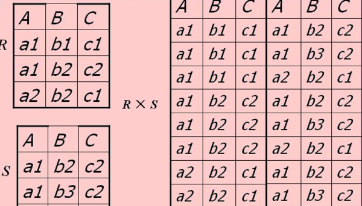

# 笛卡尔积 cartesian product

## 笛卡尔积
**笛卡尔积**又称**直积**,本身是集合中的一元运算,我们有两个集合X Y, 则X Y 的笛卡尔积表示, X Y中元组按序构成的**所有可能的有序对** $$<t_1,t_2>$$的集合T

$$ T=X \times Y =  \{<t_1,t_2>) \mid t_1 \in X \land t_2 \in Y \}$$

* 有序对$$<t_1,t_2>$$,顺序不可对调
* 域的笛卡尔积不满足交换律(区别广义笛卡尔积) $$ X \times Y \neq Y \times X  $$ 

引申到关系中某两个属性域的积: 两个域 D1 D2构成的笛卡尔积
 
$$ D=A_1 \times A_2 =  \{<a_1,a_2>) \mid a_1 \in D_1 \land a_2 \in D_2 \}$$

## 广义笛卡尔积

在关系中,一个关系不可能只存在一个属性,这样引入广义笛卡尔积,为所有可能的**元组对**的集合,广义笛卡尔积是对**由多分量元组构成的集合**的积

### 定义
定义:　我们有两个关系 R S

$$ R = \{ r \mid r=<a_1,a_2,...,a_n> \}  \\
degree(R) = d_r \\
cardinality(R) = c_r 
 $$

$$ S = \{ s \mid s=<b_1,b_2,...,b_m> \}   
\\
degree(S) = d_s \\
cardinality(S) =c_s 
$$

即为：R S 构成的广义笛卡尔积

$$ T =R \times S \\
\quad =  \{<t_1,t_2>) \mid t_1=<r_i> \in R \land t_2=<b_i> \in S \} \\  
 \quad = \{ <a_1 ,a_2,..., a_n, b_1, b_2,..., b_m> \mid  <a_1 ,a_2, …, a_n > \in R \land <b1, b2, …, bm> \in S \}

$$

### 广义笛卡尔积的基数和度

* 广义笛卡尔积的基数为两者基数的积
* 广义笛卡尔积的度数为两者度数的和

####  笛卡尔积的基数

若 R S的 基数分别为  $$c_r,c_s$$ ,则

$$ cardinality(R \times S) = cardinality(S) \times cardnality(R) = c_s \times c_r
$$

#### 笛卡尔积的度\目

若 R S的 度数分别为  $$d_r,d_s$$ ,则

$$ 
degree(R \times S) = degree(S) + degree(R) = d_s + d_r
$$

# 表连接(join)

## θ-连接
使用逻辑连接符θ约束连接条件()
$$ R \underset{A \theta B}{\Join} S = \pi_{t[A]\Theta{s[B]}}(R \times S ) $$  

* $$\underset{R \theta S}{\Join}$$ 中 $$\theta$$关系比较符
* $$R(A_1,A_2,...,A_n) \quad A\in\{A_1,A_2,...,A_n\} $$ : $$A$$是{\{A_1,A_2,...,A_n\}}中的某属性(A是隶属于关系R的属性)
* $$S(B_1,B_2,...,B_m) \quad A\in\{B_1,B_2,...,B_m\} $$ : $$B$$是{\{B_1,B_2,...,B_n\}}中的某属性(B是隶属于关系S的属性)
* t是A中元组 ; s是B中元组 
* t[A] 是t元组的A属性值 ;t[A] 是t元组的A属性值
